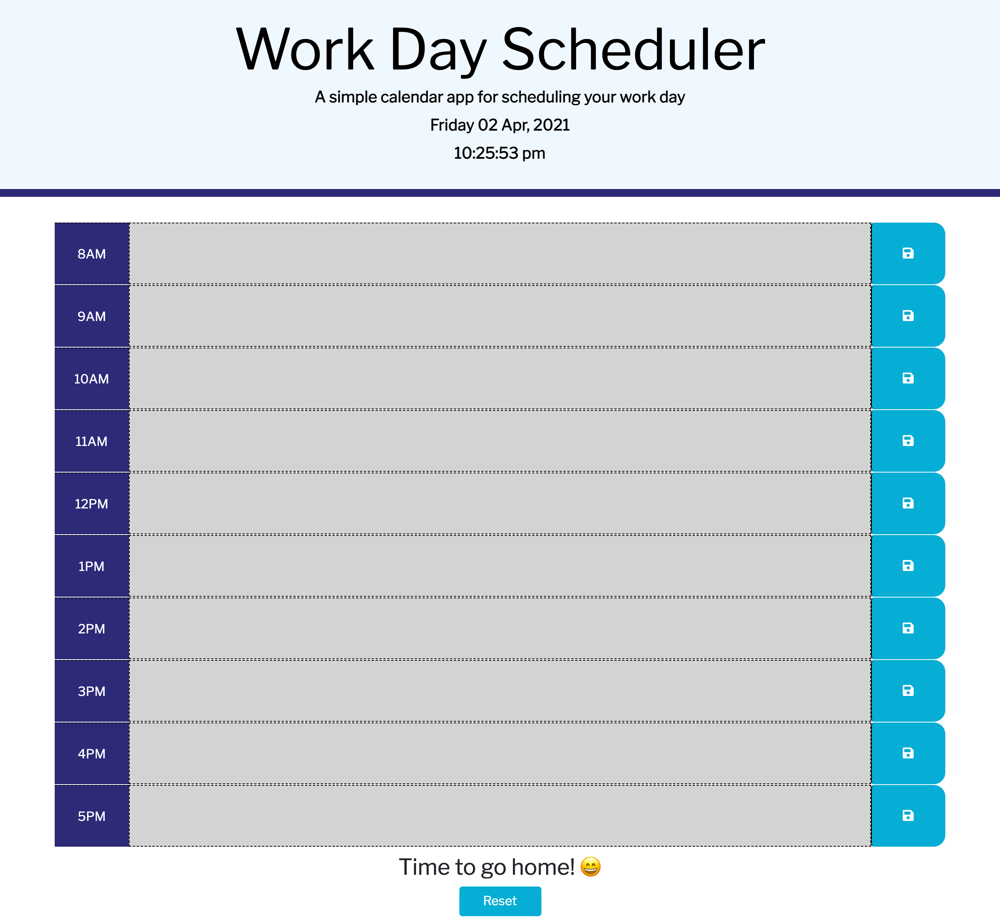

# Work day Scheduler: Third Party APIs

A simple scheduling app for a working day. 
This app loops through the working hours of the day (8am-5pm) for the current day (as per the date shown on the header).
The app allows the user to input and save text into the description field. This is then stored into the local storage of the browser. The reset button clears the local storage and any text input. In addition, the description rows of past hours are highlighted gray, the current hour is red and future hours green. 

# Table of contents
* GitHub Repository URL
* Screenshots of webpage

# GitHub Repository URL
* https://github.com/smj3085/workday_scheduler
* https://smj3085.github.io/workday_scheduler/.

# Screenshot

